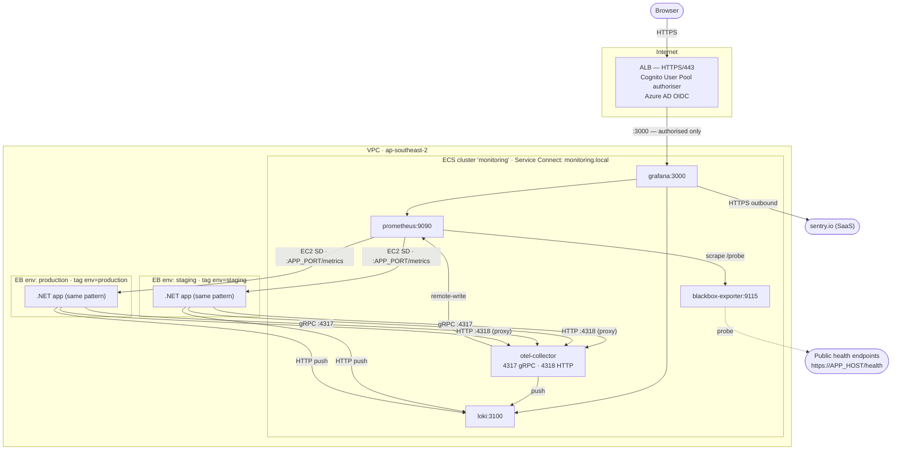
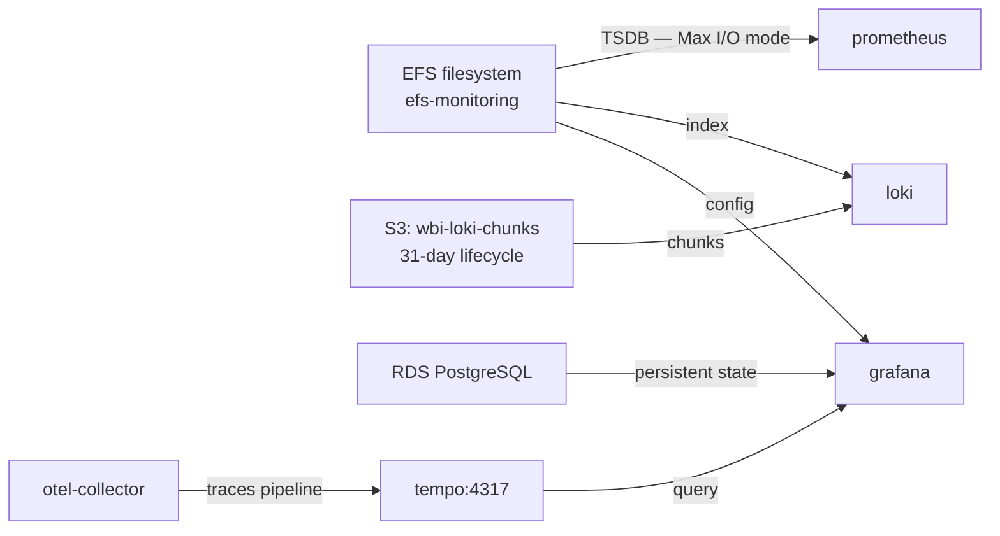

# AWS Infrastructure Requirements Specification
## Observability Platform — Workbench AI Chat Middleware PoC
### July 2026 · ap-southeast-2

---

## Purpose and Scope

This document specifies the AWS resources that must be provisioned to run the observability platform for the Workbench AI Chat Middleware. It is written for two audiences:

- **Tech lead** — to review and sign off the resource set, security posture, and cost before work begins
- **Infra team** — to provision exactly the described resources without ambiguity; implementation method (console, CLI, IaC) is the Infra team's choice

The document covers two delivery tiers:

- **PoC** — the minimum to prove the platform works end-to-end; ephemeral storage accepted; Infra team provisions this first
- **Production-grade** — incremental additions for persistence and tracing; provisioned only after PoC is verified

The platform sits alongside the existing Elastic Beanstalk environments (dev, staging, production) in the same VPC. It does not modify any existing EB resources.

### What the platform does

| Signal | Path |
|---|---|
| Metrics | .NET app exposes `/metrics`; Prometheus scrapes via EC2 service discovery |
| Logs | .NET Serilog pushes structured logs to Loki via HTTP |
| Browser telemetry | Angular OTel SDK posts to `/otlp` on the .NET app (same-origin); .NET backend proxies to OTel Collector via OTLP HTTP (port 4318) — browser never reaches the collector directly |
| .NET OTel | .NET OTel SDK pushes metrics to OTel Collector via OTLP gRPC (port 4317) |
| Uptime probing | Blackbox Exporter probes public health endpoints; results scraped by Prometheus |
| Visualisation | Grafana is the single pane of glass; accessed via ALB authenticated through Cognito |

---

## Architecture Diagram

**Trust boundaries:**
- Grafana: port 3000 open to ALB security group only — no direct browser access
- OTLP 4317/4318: open to EB security group only — .NET SDK and .NET proxy only, no public ingress
- Prometheus scrape port: open from monitoring security group only
- All other platform ports: closed from public internet

**Production-grade additions (Chunk 6):**

---

## Open Questions (must resolve before Infra team starts)

| # | Question | Owner | Status |
|---|---|---|---|
| 1 | **EB application name** — the exact name of the EB application (used for EC2 SD tag filter) | Infra team/Tech Lead | **Open** |
| 2 | **App port** — the port the .NET app listens on per EC2 instance (not the ALB port) | Infra team/Tech Lead | **Open** |
| 3 | **EB environment names** — confirm the three EB environment names map to `dev`, `staging`, `production` EC2 tags exactly | Infra team/Tech Lead | **Open** |
| 4 | **Cognito User Pool** — confirm whether an existing Cognito User Pool federated to Azure AD can be reused for the Grafana ALB, or a new one must be created | Infra team/Tech Lead | **Open** |
| 5 | **VPC ID** — VPC in which EB environments run (monitoring cluster joins the same VPC) | Infra team | **Open** |
| 6 | **RDS** — new PostgreSQL DB or new database on existing cluster (production-grade only; PoC uses SQLite) | Tech Lead | **Open** |

---

## PoC Requirements

Provision in this order: networking → IAM → secrets → ECS cluster → ECR → ECS services → ALB. Confirm each component healthy before proceeding.

### 1. Networking

#### 1.1 Security Group — `sg-monitoring`

There must be one security group named `sg-monitoring` in the same VPC as the EB environments.

**Inbound rules:**

| Port | Protocol | Source | Justification |
|---|---|---|---|
| 4317 | TCP | EB security group | OTel Collector gRPC — .NET SDK pushes from EB EC2 instances |
| 4318 | TCP | EB security group | OTel Collector HTTP — .NET backend proxies Angular OTLP metrics server-to-server; browser never reaches the collector directly |
| 4317 | TCP | `sg-monitoring` | Inter-service (OTel Collector → Tempo in production-grade; harmless to open now) |
| 9090 | TCP | `sg-monitoring` | Prometheus remote-write (OTel Collector → Prometheus) and Grafana queries |
| 3100 | TCP | `sg-monitoring` | Loki push (OTel Collector → Loki, Serilog → Loki) and Grafana queries |
| 8888 | TCP | `sg-monitoring` | OTel Collector internal metrics (Prometheus scrapes collector self-metrics) |
| 9115 | TCP | `sg-monitoring` | Blackbox Exporter metrics (Prometheus scrapes probe results) |
| 3000 | TCP | ALB security group | Grafana UI — ALB forwards authenticated requests only; no direct access |

**Outbound rules:**

| Port | Protocol | Destination | Justification |
|---|---|---|---|
| `APP_PORT` | TCP | EB security group | Prometheus scrapes `.NET /metrics` directly on EC2 instances |
| 443 | TCP | 0.0.0.0/0 | Blackbox Exporter probes public health endpoints; Grafana queries sentry.io API |
| All | All | `sg-monitoring` | Inter-platform service communication |

**No public ingress** — the public ALB fronts Grafana; all other ports are internal-only.

---

### 2. IAM

#### 2.1 ECS Task Execution Role — `ecs-task-execution-monitoring`

Used by the ECS agent to pull images and read secrets. Required by all five platform services.

**Permissions required:**

- `ecr:GetAuthorizationToken` — pull images from ECR (region-scoped)
- `ecr:BatchCheckLayerAvailability`, `ecr:GetDownloadUrlForLayer`, `ecr:BatchGetImage` — on the five ECR repositories listed in §3
- `secretsmanager:GetSecretValue` — on the following specific Secrets Manager ARNs:
  - `arn:aws:secretsmanager:ap-southeast-2:*:secret:wbi-monitoring/grafana/sentry-token*`
  - `arn:aws:secretsmanager:ap-southeast-2:*:secret:wbi-monitoring/grafana/db-password*` (production-grade only — provision now for forward compatibility)
- `logs:CreateLogStream`, `logs:PutLogEvents` — on CloudWatch log group `/ecs/monitoring/*`

#### 2.2 ECS Task Role — `ecs-task-role-prometheus`

Used by the running Prometheus container to call AWS APIs. Required only by the Prometheus service.

**Permissions required:**

- `ec2:DescribeInstances` — region-scoped (`ap-southeast-2`); required for EC2 service discovery (`ec2_sd_configs`) to enumerate EB instance IPs and tags

No other platform service needs a task role at PoC tier.

#### 2.3 Production-Grade Task Role — `ecs-task-role-loki` (Chunk 6 only)

- `s3:GetObject`, `s3:PutObject`, `s3:DeleteObject`, `s3:ListBucket` — on `arn:aws:s3:::wbi-loki-chunks` and `arn:aws:s3:::wbi-loki-chunks/*`

Provision this role now so it can be referenced in the Loki task definition from the start; it becomes active only when Chunk 6 updates `loki.yml` to the S3 backend.

---

### 3. Secrets Manager

Pre-create these secrets with placeholder values. The Infra team is responsible for populating the actual values. Secret names must exactly match — the ECS task definitions reference them by name.

| Secret name | Type | Expected value | Who populates |
|---|---|---|---|
| `wbi-monitoring/grafana/sentry-token` | SecureString | Sentry org-level auth token (created at sentry.io → Settings → Auth Tokens; needs `org:read` scope) | Team |
| `wbi-monitoring/grafana/db-password` | SecureString | Grafana RDS PostgreSQL password (production-grade only — create secret now, populate when RDS is provisioned in Chunk 6) | Infra team |

---

### 4. ECR Repositories

Five private repositories in `ap-southeast-2`. All repositories use immutable tags.

| Repository name | Image built from |
|---|---|
| `prometheus-wbi` | `monitoring/Dockerfile.prometheus` |
| `loki-wbi` | `monitoring/Dockerfile.loki` |
| `grafana-wbi` | `monitoring/Dockerfile.grafana` |
| `blackbox-wbi` | `monitoring/Dockerfile.blackbox` |
| `otel-collector-wbi` | `monitoring/Dockerfile.otel-collector` |

Production-grade (Chunk 6):

| Repository name | Image built from |
|---|---|
| `tempo-wbi` | `monitoring/Dockerfile.tempo` |

---

### 5. ECS Cluster

There must be one ECS cluster named `monitoring` in `ap-southeast-2`.

**ECS Service Connect** must be enabled on this cluster with a private DNS namespace named `monitoring.local`. All five services register under their short service names (`prometheus`, `loki`, `grafana`, `blackbox-exporter`, `otel-collector`) so inter-service references resolve using the same hostnames as Docker Compose. This is how the OTel Collector reaches Prometheus at `http://prometheus:9090` and Loki at `http://loki:3100` without environment-specific config.

---

### 6. ECS Services (PoC)

#### 6.1 Prometheus

| Property | Value |
|---|---|
| Service name | `prometheus` |
| Task CPU | 256 (0.25 vCPU) |
| Task memory | 512 MB |
| Launch type | FARGATE |
| Platform version | LATEST |
| Desired count | 1 |
| Port mapping | 9090 (container) |
| Service Connect | Register as `prometheus`, port 9090 |
| Task execution role | `ecs-task-execution-monitoring` |
| Task role | `ecs-task-role-prometheus` |

**Environment variables (task definition `environment` array):**

None required at PoC tier — Prometheus config is baked into the image.

**Storage:** Ephemeral (PoC). Data is lost on task restart. Accepted for PoC.

**CloudWatch log group:** `/ecs/monitoring/prometheus` — must exist before the task starts.

**Justification:** Metrics storage and query engine. EC2 service discovery requires the task role with `ec2:DescribeInstances`. Remote-write receiver is enabled in the Dockerfile entrypoint (`--web.enable-remote-write-receiver`) so the OTel Collector can push metrics to Prometheus.

#### 6.2 Loki

| Property | Value |
|---|---|
| Service name | `loki` |
| Task CPU | 512 (0.5 vCPU) |
| Task memory | 1024 MB |
| Launch type | FARGATE |
| Desired count | 1 |
| Port mapping | 3100 (container) |
| Service Connect | Register as `loki`, port 3100 |
| Task execution role | `ecs-task-execution-monitoring` |
| Task role | `ecs-task-role-loki` (inactive at PoC tier; activates in Chunk 6) |

**Environment variables:** None required at PoC tier — config is baked into the image.

**Storage:** Ephemeral (PoC). Log data is lost on task restart. Accepted for PoC.

**CloudWatch log group:** `/ecs/monitoring/loki`

**Justification:** Log aggregation. Higher CPU/memory allocation than Prometheus and the other services because Loki must ingest structured logs from all three EB environments simultaneously and maintain the TSDB index in memory.

#### 6.3 Grafana

| Property | Value |
|---|---|
| Service name | `grafana` |
| Task CPU | 256 (0.25 vCPU) |
| Task memory | 512 MB |
| Launch type | FARGATE |
| Desired count | 1 |
| Port mapping | 3000 (container) |
| Service Connect | Register as `grafana`, port 3000 |
| Task execution role | `ecs-task-execution-monitoring` |
| Task role | (none at PoC) |

**Environment variables (task definition `environment` array):**

| Variable | Value | Notes |
|---|---|---|
| `GF_SERVER_ROOT_URL` | `https://[GRAFANA_ALB_HOSTNAME]` | ALB DNS name or custom domain; Infra team provides after ALB is created |

**Secrets (task definition `secrets` array, Secrets Manager ARN reference):**

| Variable | Secret ARN |
|---|---|
| `SENTRY_ORG_TOKEN` | ARN of `wbi-monitoring/grafana/sentry-token` |

**Storage:** Ephemeral SQLite (PoC). Dashboard and alert rule state is lost on task restart. Accepted for PoC — provisioned as code from the repo, so all dashboards and alert rules reload on next deploy.

**CloudWatch log group:** `/ecs/monitoring/grafana`

**Justification:** Single pane of glass. `GF_SERVER_ROOT_URL` must be the ALB URL — without it Grafana-generated links (alert notifications, share URLs) will be wrong. `SENTRY_ORG_TOKEN` is the org-level Sentry token required by the `grafana-sentry-datasource` plugin.

#### 6.4 Blackbox Exporter

| Property | Value |
|---|---|
| Service name | `blackbox-exporter` |
| Task CPU | 128 (0.125 vCPU) |
| Task memory | 256 MB |
| Launch type | FARGATE |
| Desired count | 1 |
| Port mapping | 9115 (container) |
| Service Connect | Register as `blackbox-exporter`, port 9115 |
| Task execution role | `ecs-task-execution-monitoring` |

**Environment variables:** None.

**CloudWatch log group:** `/ecs/monitoring/blackbox-exporter`

**Justification:** Endpoint uptime probing. Prometheus scrapes Blackbox at port 9115 to collect `probe_success` metrics for the health check endpoints of each EB environment.

#### 6.5 OTel Collector

| Property | Value |
|---|---|
| Service name | `otel-collector` |
| Task CPU | 256 (0.25 vCPU) |
| Task memory | 512 MB |
| Launch type | FARGATE |
| Desired count | 1 |
| Port mappings | 4317 (gRPC OTLP), 4318 (HTTP OTLP) |
| Service Connect | Register as `otel-collector`, ports 4317 and 4318 |
| Task execution role | `ecs-task-execution-monitoring` |

**Environment variables:** None — config is baked into the image.

**CloudWatch log group:** `/ecs/monitoring/otel-collector`

**Justification:** Receives OTLP telemetry from all services and fans it out to Prometheus (remote-write) and Loki. The .NET SDK pushes metrics via gRPC on 4317. Angular browser metrics are proxied through the .NET backend (same-origin `/otlp` endpoint) and arrive at the collector via HTTP on 4318 — the browser never reaches the collector directly. This keeps 4318 internal to the VPC and means no public exposure or CORS configuration is required on the collector.

---

### 7. Application Load Balancer

There must be one ALB for Grafana access. This is the only public-facing entry point for the platform.

| Property | Value |
|---|---|
| Name | `alb-monitoring` |
| Scheme | Internet-facing |
| Listener | HTTPS/443 |
| SSL certificate | ACM certificate for the Grafana hostname (Infra team provisions or uses existing wildcard cert) |
| Authentication | Cognito User Pool authorizer on the HTTPS listener |
| Target group | Forward to Grafana ECS service on port 3000 |
| Health check path | `/api/health` |
| Stickiness | Enabled (Grafana requires session affinity) |

**Cognito User Pool authorizer:**

- Create (or reuse) a Cognito User Pool with an OIDC identity provider federated to Azure AD
- The User Pool client must allow the ALB as a callback URL (`https://[GRAFANA_ALB_HOSTNAME]/oauth2/idpresponse`)
- Anyone who authenticates through Cognito gets access to Grafana — no Grafana-level role mapping is required at PoC tier
- Confirm whether an existing Cognito User Pool (used by other internal ALBs) can be reused; if yes, add a new app client for the monitoring ALB

**Grafana trusts the ALB/Cognito layer.** No Grafana OAuth configuration is required. This is consistent with how other internal services handle authentication.

---

---

## Per-Project Requirements — AI Chat Middleware

These requirements belong to the AI Chat Middleware project, not the platform. They are listed here because the platform cannot receive signals from the app until they are in place. Each onboarded project will have an equivalent section.

### EB Environment Tags

Prometheus EC2 service discovery (`ec2_sd_configs`) relies on two EC2 instance tags to filter and label instances correctly. The Infra team must confirm these tags are present on all running EC2 instances in each EB environment before Chunk 5 starts.

| EB environment | Required EC2 tag | Value |
|---|---|---|
| Staging | `env` | `staging` |
| Production | `env` | `production` |
| All | `elasticbeanstalk:application-name` | `[EB_APPLICATION_NAME]` |

EB propagates environment-level tags to all EC2 instances in that environment automatically — the Infra team sets the tag at the EB environment level, not per-instance. The `elasticbeanstalk:application-name` tag is set by EB automatically.

### EB Environment Properties

The following environment properties must be set on each EB environment. These are injected into the .NET app at runtime.

| Property | Staging value | Production value |
|---|---|---|
| `ENV_NAME` | `staging` | `production` |
| `LOKI_URI` | `http://loki:3100` (ECS Service Connect) | same |
| `OTEL_EXPORTER_OTLP_ENDPOINT` | `http://otel-collector:4317` (ECS Service Connect) | same |
| `SENTRY_DSN` | from `wbi-ai/chat/sentry-dsn` secret | same |

### Secrets Manager Secret

| Secret name | Type | Expected value | Who populates |
|---|---|---|---|
| `wbi-ai/chat/sentry-dsn` | SecureString | Sentry DSN for the `ai-chat-angular` project (format: `https://...@sentry.io/...`) | Team (Sentry project already exists; DSN from sentry.io project settings) |

---

## Production-Grade Requirements (Chunk 6)

Provision after PoC is verified. Listed here so the Infra team can plan ahead and avoid having to return to IAM or networking after the fact.

### EFS Filesystem

There must be one EFS filesystem named `efs-monitoring` with:

- Mount targets in each AZ used by the EB environments (so ECS Fargate tasks in those AZs can mount it)
- **Three access points:**
  - `/prometheus` — owner UID 65534 (nobody), mode 0755; used by the Prometheus task for TSDB storage
  - `/loki` — owner UID 10001, mode 0755; used by the Loki task for index storage
  - `/grafana` — owner UID 472, mode 0755; used by the Grafana task for SQLite (before RDS migration) and then config
- **EFS Max I/O performance mode** for the Prometheus mount point — Prometheus TSDB compaction performs many small random reads; General Purpose mode hits IOPS ceiling every few hours and stalls Prometheus for 30–60 seconds

EFS ARN and access point ARNs are required outputs.

### S3 Bucket

There must be one S3 bucket named `wbi-loki-chunks` in `ap-southeast-2` with:

- Versioning disabled
- Lifecycle rule: expire objects after 31 days
- Block all public access
- No replication (single-region PoC)

The Loki task role (`ecs-task-role-loki`) must have `s3:GetObject`, `s3:PutObject`, `s3:DeleteObject`, `s3:ListBucket` on this bucket — already specified in §2.3.

### RDS Database (Grafana state)

There must be one PostgreSQL database for Grafana state. The choice of new database vs new database on an existing RDS cluster is the Infra team's decision.

Requirements:
- PostgreSQL 15 or later
- Database name: `grafana`
- Master username: `grafana`
- The full connection secret (`host`, `port`, `dbname`, `username`, `password`) must be stored in a single Secrets Manager secret named `wbi-monitoring/grafana/db-connection`
- Grafana task definition will inject these as individual env vars (`GF_DATABASE_HOST`, `GF_DATABASE_NAME`, `GF_DATABASE_USER`, `GF_DATABASE_PASSWORD`) from the secret

The Grafana SQLite database will be migrated to RDS as part of Chunk 6. PoC data is considered throwaway.

### Grafana Tempo (Chunk 6)

| Property | Value |
|---|---|
| ECR repository | `tempo-wbi` |
| Service name | `tempo` |
| Task CPU | 512 (0.5 vCPU) |
| Task memory | 1024 MB |
| Port | 4317 (gRPC) |
| Service Connect | Register as `tempo`, port 4317 |
| EFS mount | `/tempo` access point on `efs-monitoring` |

The OTel Collector routes traces to `http://tempo:4317` via ECS Service Connect.

---

## Variable Strategy

Non-secret configuration goes in the ECS task definition `environment` array. Secrets go in the `secrets` array referencing Secrets Manager ARNs. Values that vary per deployment use `#{TOKEN}#` pipeline substitution applied before task definition registration.

No secret values are committed to the repository.

| Variable | Task | Source | Notes |
|---|---|---|---|
| `GF_SERVER_ROOT_URL` | Grafana | `environment` array | ALB DNS name or custom domain |
| `GF_DATABASE_HOST` | Grafana (prod-grade) | `environment` array | From Infra team RDS output |
| `GF_DATABASE_NAME` | Grafana (prod-grade) | `environment` array | `grafana` |
| `GF_DATABASE_USER` | Grafana (prod-grade) | `environment` array | `grafana` |
| `GF_DATABASE_PASSWORD` | Grafana (prod-grade) | `secrets` array | Secrets Manager ARN for `wbi-monitoring/grafana/db-connection` |
| `SENTRY_ORG_TOKEN` | Grafana | `secrets` array | Secrets Manager ARN for `wbi-monitoring/grafana/sentry-token` |

Per-deployment values injected via `#{TOKEN}#` pipeline substitution:

| Token | Used in | Value at deploy time |
|---|---|---|
| `#{ECR_REGISTRY}#` | All task defs (image URI) | ECR registry hostname |
| `#{IMAGE_TAG}#` | All task defs (image URI) | Git commit SHA from Azure DevOps build |

---

## Pipeline Agent IAM Requirements

The Azure DevOps pipeline agent needs the following IAM permissions to run the `DeployMonitoring` stage. These are incremental additions to whatever role the agent already uses.

| Permission | Resource scope | Justification |
|---|---|---|
| `ecr:GetAuthorizationToken` | `*` | Docker login to ECR |
| `ecr:BatchCheckLayerAvailability`, `ecr:PutImage`, `ecr:InitiateLayerUpload`, `ecr:UploadLayerPart`, `ecr:CompleteLayerUpload` | Five ECR repository ARNs | Push built images |
| `ecs:RegisterTaskDefinition` | `*` | Register new task definition revisions |
| `ecs:DescribeServices`, `ecs:UpdateService` | Monitoring cluster ARN | Force-deploy ECS services |
| `iam:PassRole` | `ecs-task-execution-monitoring` and `ecs-task-role-prometheus` ARNs | ECS requires the caller to be able to pass the task roles |

---

## Required Outputs from Infra team

The following values are needed before Chunk 5 (PoC AWS deployment) can proceed. The Infra team must provide them upon completing the PoC provisioning.

| Output | Where it is used |
|---|---|
| ECS cluster ARN | Pipeline `DeployMonitoring` stage and runbook |
| ECR repository URIs (all five) | Image push targets in pipeline; image URIs in task definitions |
| `sg-monitoring` security group ID | EB security group egress rule update; pipeline runbook |
| ALB DNS name / Grafana URL | `GF_SERVER_ROOT_URL` environment variable in Grafana task definition; Cognito callback URL |
| Secrets Manager ARNs (platform secrets) | Task definition `secrets` array — `wbi-monitoring/grafana/sentry-token` and (prod-grade) `wbi-monitoring/grafana/db-password` |
| CloudWatch log group names (all five) | Confirmation they were created before services start |
| EB application name | Fills `[EB_APPLICATION_NAME]` in `prometheus-aws.yml` EC2 SD filter — see Per-Project Requirements |
| Per-service app port | Fills `[APP_PORT]` in `prometheus-aws.yml` EC2 SD `port` field — see Per-Project Requirements |
| Confirmation: EC2 `env` tags | Confirm `env=staging`, `env=production` tags are present on all EB EC2 instances — see Per-Project Requirements |

Production-grade additional outputs (Chunk 6):

| Output | Where it is used |
|---|---|
| EFS filesystem ID and access point ARNs | Task definition EFS mount config for Prometheus, Loki, Grafana |
| S3 bucket name confirmation | `loki.yml` S3 backend config |
| RDS endpoint, database name | Grafana task definition `GF_DATABASE_*` env vars |
| `tempo-wbi` ECR repository URI | Tempo task definition |

---

## Acceptance Criteria (tech lead sign-off)

- [ ] Every resource has a name, a size/spec, and a one-line justification
- [ ] Security group inbound rules are fully enumerated — no "open as needed"
- [ ] No secret values appear in this document or in any committed config file
- [ ] PoC tier and production-grade tier are clearly separated
- [ ] All open questions in the table above are resolved before Infra team starts
- [ ] Infra team required outputs table is complete — no output a downstream step could need is missing
- [ ] Document can be handed to the Infra team without a verbal walkthrough
