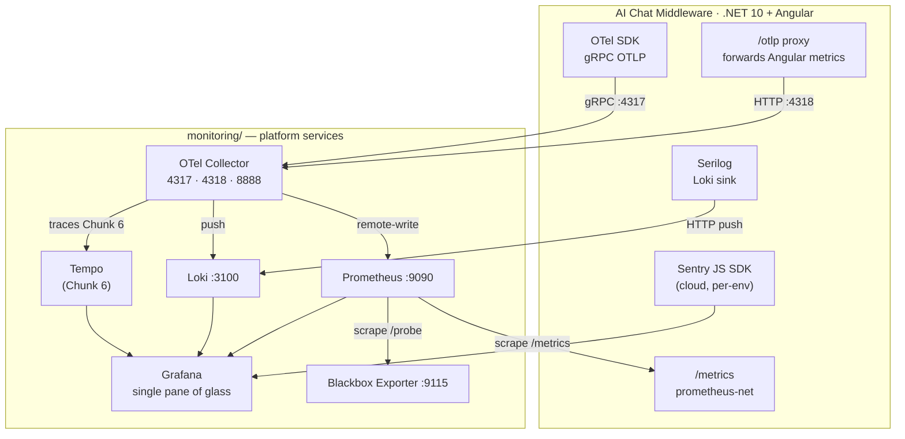

# Observability Platform — Implementation Plan
## Session 0 output · July 2026

---

## Architecture Sketch



```
monitoring/               ← single source of truth for all platform config
  prometheus/
    prometheus.yml        ← local static scrape
    prometheus-aws.yml    ← AWS ec2_sd_configs (baked into Dockerfile.prometheus)
    rules/ai-chat.yml     ← recording rules (evaluated by Prometheus)
  loki/loki.yml
  blackbox/blackbox.yml
  otel-collector/otel-collector.yml
  grafana/provisioning/   ← datasources, dashboards, alerting
  grafana/dashboards/     ← ai-chat.json, platform.json
  Dockerfile.*            ← one per service (config baked in at build time)

Deploy path: Azure DevOps → ECR (custom images) → ECS Fargate (monitoring cluster)
Prometheus scrapes EC2 instances directly via ec2_sd_configs (not through the EB ALB)
```

**Key design decisions:**
- `env` label is the spine of the whole system — must be set identically in Prometheus scrape configs, Loki push labels, and OTel resource attributes
- Config baked into Docker images (PoC) → EFS-mounted (production-grade)
- Grafana provisioned as code; dashboards exported to JSON and committed
- Sentry is SaaS-only; Grafana shows JS error counts but links out for detail
- Platform self-monitors via a `platform-self` Prometheus scrape job and a `platform.json` meta-monitoring dashboard — no external tooling required to know if the monitoring stack itself is healthy

---

## Variable strategy (reference for all chunks)

All environment-specific and secret values are injected — nothing hardcoded in committed config files except local Docker Compose defaults.

| Variable | Type | Local (Docker Compose) | EB / ECS (injected at deploy) | Injected by |
|---|---|---|---|---|
| `ENV_NAME` | Plain | `local` (hardcoded in `appsettings.Development.json`) | `dev` / `staging` / `production` | EB env property; `#{ENV_NAME}#` token in ECS task def |
| `LOKI_URI` | Plain | `http://loki:3100` (Docker Compose service name) | Infra team-provided internal URI | EB env property |
| `OTEL_EXPORTER_OTLP_ENDPOINT` | Plain | `http://otel-collector:4317` (Docker Compose) | Infra team-provided internal URI | EB env property |
| `ANGULAR_OTLP_ENDPOINT` | Plain | `http://localhost:4318` (fallback in `environment.ts`) | n/a — Angular always sends to `/otlp` on the .NET app (same-origin proxy); this variable is no longer injected as an EB env property | n/a (see Chunk 4c) |
| `SENTRY_DSN` | Secret | placeholder in `environment.ts` | Secrets Manager → EB env property | Secrets Manager (`wbi-ai/chat/sentry-dsn`) |
| `SENTRY_ORG_TOKEN` | Secret | n/a (Grafana datasource only) | Secrets Manager → ECS task (`secrets` array) | Secrets Manager (`wbi-monitoring/grafana/sentry-token`) |
| `GF_DATABASE_HOST` | Plain | n/a (SQLite in PoC) | Infra team-provided RDS hostname | ECS task def `environment` array |
| `GF_DATABASE_NAME` | Plain | n/a | Infra team-provided DB name | ECS task def `environment` array |
| `GF_DATABASE_USER` | Plain | n/a | Infra team-provided username | ECS task def `environment` array |
| `GF_DATABASE_PASSWORD` | Secret | n/a | Secrets Manager → ECS task | Secrets Manager (full connection secret) |
| `GF_SERVER_ROOT_URL` | Plain | `http://localhost:3000` (Docker Compose) | ALB URL (e.g. `https://grafana.internal`) | ECS task def `environment` array |
| `GRAFANA_ADMIN_PASSWORD` | Secret | local `.env` file (gitignored) | n/a (Cognito/ALB handles auth in AWS) | local `.env` only |
| `window.__env.envName` | Runtime | `local` (fallback in `environment.ts`) | sourced from `ENV_NAME` by .NET, served in `window.__env` | .NET serves inline script at page load |
| `window.__env.sentryDsn` | Runtime | placeholder (fallback in `environment.ts`) | sourced from `SENTRY_DSN` by .NET, served in `window.__env` | .NET serves inline script at page load |
| `window.__env.otlpEndpoint` | Runtime | `"/otlp"` (hardcoded relative path) | always `"/otlp"` — not sourced from an env var; .NET proxy hardcodes `http://otel-collector:4318` as the destination | .NET serves inline script at page load |

ECS task definitions use `environment` array for plain values and `secrets` array (Secrets Manager ARN reference) for secrets — no secret values in the repo.

---

## Implementation Chunks

---

### Chunk 1 — Service instrumentation (.NET backend)
**Session:** 1

**What gets built:**
- `Serilog.Sinks.Grafana.Loki` package added; `appsettings.Development.json` configured with `http://loki:3100`, labels `service` + `env`, **`propertiesAsLabels: []`**; `appsettings.Production.json` reads Loki URI from `LOKI_URI` env var with same label and `propertiesAsLabels` config
- Correlation ID middleware (`CorrelationIdMiddleware.cs`) registered in `Program.cs`
- Structured logging audit: all `$"..."` interpolated Serilog calls converted to message templates
- `prometheus-net.AspNetCore` added; `UseHttpMetrics()` + `MapPrometheusScrapingEndpoint()` wired outside any auth policy
- SignalR and chat custom metrics (`signalr_connections_active`, `chat_messages_total`)
- OTel .NET SDK (`OpenTelemetry.Extensions.Hosting` + ASP.NET Core + HTTP instrumentation + OTLP exporter + `Serilog.Enrichers.OpenTelemetry`); OTLP endpoint read from `OTEL_EXPORTER_OTLP_ENDPOINT` env var (defaults to `http://otel-collector:4317` for local); `deployment.environment` resource attribute from `ENV_NAME`; metrics only
- **Serilog enrichers**: `.Enrich.WithOpenTelemetryTraceId()` and `.Enrich.WithOpenTelemetrySpanId()` added to the Serilog configuration — writes `TraceId`/`SpanId` fields into every log line (empty until Chunk 6, harmless)

**Success criteria:**
- `GET /metrics` returns Prometheus-format output including custom SignalR/chat metrics
- Structured log properties (`TenantId`, `ConversationId`, `CorrelationId`) appear as fields, not embedded strings, in local console output
- `X-Correlation-ID` echoed in response headers
- Zero string-interpolated `Log.*` calls remain (grep check)
- OTel SDK initialises without errors at startup

**Risks / gotchas:**
- The logging audit can be large depending on call-site count — do a grep first to size it before committing to the session
- `ENV_NAME` doesn't exist in `appsettings.Development.json`; hardcode `"local"` there, not a variable reference
- OTel Collector isn't running locally yet; SDK will log export errors — suppress or use a null exporter in dev until Chunk 3
- **Auth middleware and `/metrics`**: the app uses Entra (Azure AD) app registration auth. `MapPrometheusScrapingEndpoint()` must be registered *outside* any `RequireAuthorization()` policy — Prometheus scrapes without a token and relies on the VPC security group as the access boundary. Do not add bearer token auth to the metrics endpoint. Same principle applies to Loki push and OTLP push: both target internal-only services with no public ingress, so no token is needed for those flows either. **Check whether auth is applied via a global fallback policy or per-route** — a global fallback will catch `/metrics` and must explicitly exclude it; per-route auth does not require exclusion. This check must be added to the portable Service Onboarding Prompt (Chunk 7)
- **Blackbox probe targets**: only probe unauthenticated endpoints (`/health`, `/hubs/aichat/negotiate`). Do not probe AD-protected API endpoints — a broken auth config would produce a false positive uptime result
- **[BLOCKER] Loki label cardinality**: set `propertiesAsLabels: []` in both `appsettings.Development.json` and `appsettings.Production.json` Loki sink config. Without it, the sink promotes every Serilog enriched property (`TenantId`, `CorrelationId`, etc.) to a Loki stream label, which will exhaust `max_streams_per_user` and cause Loki to reject log pushes. All per-request fields must live in the log body only.
- **[BLOCKER] TraceID/SpanID in logs**: add `Serilog.Enrichers.OpenTelemetry` package and call `.Enrich.WithOpenTelemetryTraceId().Enrich.WithOpenTelemetrySpanId()` in the Serilog configuration. This must be done in Chunk 1 — before tracing is enabled. The fields will be empty until Chunk 6 adds `WithTracing(...)`, which is expected. If omitted now, the Loki→Tempo one-click correlation can never be backfilled for historical logs.

---

### Chunk 2 — Service instrumentation (Angular frontend)
**Session:** 2

**What gets built:**
- `window.__env` runtime config pattern introduced: the .NET app serves an inline script (e.g. in `index.html` via a Razor tag helper, or a `/env.js` endpoint) that writes `window.__env = { envName, sentryDsn, otlpEndpoint }` using values from its own environment variables (`ENV_NAME`, `SENTRY_DSN`, `OTEL_EXPORTER_OTLP_ENDPOINT`). Angular reads these at bootstrap — no per-environment build required
- `environment.ts` updated to read from `window.__env` with local dev fallbacks (`envName: 'local'`, placeholder DSN, `otlpEndpoint: 'http://localhost:4318'`)
- `@sentry/angular` installed and initialised; DSN from `environment.sentryDsn`; `environment` field from `environment.envName`; **`beforeSend` hook attaches active OTel span context as `trace_id`/`span_id` tags** on every Sentry event
- **`CorrelationIdInterceptor`** (`HttpInterceptor`) added — reads `X-Correlation-ID` from API response headers, calls `Sentry.setTag('correlation_id', value)`
- `@opentelemetry/sdk-web` + `@opentelemetry/auto-instrumentations-web` installed; OTLP endpoint from `environment.otlpEndpoint`; `deployment.environment` attribute from `environment.envName`; metrics only
- Sentry project created at sentry.io (`ai-chat-angular`); DSN obtained and stored in Secrets Manager (`wbi-ai/chat/sentry-dsn`)

**Success criteria:**
- Triggering a deliberate JS error in dev reaches sentry.io under the `local` environment
- OTel SDK initialises; network tab shows OTLP export attempts to `localhost:4318` (even if collector isn't up yet)
- `envName` is `"local"` in dev, not undefined
- `window.__env` values are visible in browser console in dev

**Risks / gotchas:**
- CORS: browser OTel OTLP export will be blocked by the collector's CORS policy until the collector is configured to allow it — known gap, fixed in Chunk 3
- `@sentry/angular` version must match the Angular major version — check compatibility matrix before installing
- Source map upload (`sentry-cli`) is a pipeline concern deferred to Chunk 5; don't block this session on it
- **[BLOCKER] Sentry events must carry TraceID**: add a `beforeSend` hook to `Sentry.init` that reads the active OTel span context and attaches `trace_id` and `span_id` as Sentry event tags. Without this, a Sentry error has no path back to the corresponding Loki log line or Tempo trace. The hook is a no-op when no active span exists (e.g. outside a traced request). Implementation: `const ctx = trace.getActiveSpan()?.spanContext(); if (ctx) event.tags = { ...event.tags, trace_id: ctx.traceId, span_id: ctx.spanId };`
- **CorrelationID propagation**: add an Angular `HttpInterceptor` that reads `X-Correlation-ID` from API response headers and calls `Sentry.setTag('correlation_id', value)`. This links frontend Sentry errors to backend Loki log lines by CorrelationId — the bridge between the two non-OTel systems.

---

### Chunk 3 — Local platform stack ✅ COMPLETE
**Session:** 3

**What gets built:**
- Full `monitoring/` directory structure created
- `prometheus/prometheus.yml` — local Docker Compose scrape job for AI Chat Middleware using `static_configs` (Docker Compose service name); `scrape_interval: 15s`, `scheme: http`, `scrape_timeout: 10s`; dedicated blackbox job with `scrape_interval: 30s` and full `relabel_configs` (see spec)
- `prometheus/prometheus-aws.yml` — AWS scrape config using `ec2_sd_configs`; one job per service filtered by `elasticbeanstalk:application-name` tag; `relabel_configs` that keep only running instances and map the `env` EC2 tag to a Prometheus label (see spec); same blackbox job as `prometheus.yml`; baked into `Dockerfile.prometheus` (which copies this file, not `prometheus.yml`)
- `prometheus/rules/ai-chat.yml` — recording rules for request rate, p95 latency, error rate (see spec); referenced via `rule_files` in `prometheus.yml`
- `loki/loki.yml` — full PoC config from spec (auth, server, storage, schema, `limits_config`) — not a placeholder
- `blackbox/blackbox.yml` — probe targets: `/health`, `/hubs/aichat/negotiate`
- `otel-collector/otel-collector.yml` — OTLP receivers (4317/4318), all processors (`memory_limiter`, `resourcedetection`, `transform/sanitize_metrics`, `batch`), Prometheus remote-write exporter, Loki exporter; CORS `allowed_origins` set for local Angular origin
- `grafana/provisioning/datasources/` — `prometheus.yaml` (`http://prometheus:9090`), `loki.yaml` (`http://loki:3100`, with Derived Fields config for Loki→Tempo click-through), `sentry.yaml` (org token from `SENTRY_ORG_TOKEN` env var — not hardcoded)
- `grafana/provisioning/dashboards/dashboards.yaml` — pointer to dashboards dir
- `grafana/provisioning/alerting/rules.yaml` — all standard + AI Chat Middleware-specific alert rules; `EndpointDown` uses `for: 2m`, all others `for: 5m`
- Five custom Dockerfiles (Grafana Dockerfile installs `grafana-sentry-datasource` plugin at build time; Prometheus Dockerfile has `--web.enable-remote-write-receiver` in ENTRYPOINT)
- Five Docker Compose service blocks added to the application's compose file; `SENTRY_ORG_TOKEN`, `GRAFANA_ADMIN_PASSWORD`, and `GF_SERVER_ROOT_URL` passed to Grafana container; secrets from a local `.env` file (gitignored)
- `ai-chat.json` dashboard built interactively in Grafana and exported/committed; dashboard panels query recording rule series (`job:http_requests_total:rate5m` etc.) not raw metrics
- `platform-self` scrape job added to both `prometheus.yml` and `prometheus-aws.yml` — scrapes Prometheus (`:9090/metrics`), Loki (`:3100/metrics`), OTel Collector (`:8888/metrics`), Blackbox Exporter (`:9115/metrics`) with a `component` label per target
- `platform.json` meta-monitoring dashboard built and exported; panels listed in spec §1.7
- `CollectorDroppingData` alert rule added to `grafana/provisioning/alerting/rules.yaml`

**Success criteria (full local observability loop):**
- `docker compose up` starts all five platform services without error
- Prometheus scrapes the .NET app; metrics visible at `localhost:9090`; recording rules appear as series in Prometheus
- `GET /metrics` data visible in a Grafana Prometheus panel; dashboard loads in under 2 seconds
- Loki receives structured logs; a LogQL query returns results with queryable `TenantId`/`CorrelationId` fields; `TraceId` field present in log lines (empty value is fine — populated in Chunk 6)
- Blackbox probe results visible in Grafana; both probe targets show `probe_success=1`
- Sentry error count panel populated (even if count is 0)
- All standard alert rules exist in Grafana Alerting with correct `for` durations; `CollectorDroppingData` alert rule present
- `ai-chat.json` and `platform.json` both committed to `monitoring/grafana/dashboards/`
- `platform.json` renders all panels with real data from the local stack; OTel Collector queue depth and drop rate visible

**Risks / gotchas:**
- Grafana Sentry data source: use the **official `grafana-sentry-datasource` plugin** (Grafana Labs). Bake into the custom Grafana Dockerfile via `grafana-cli plugins install grafana-sentry-datasource` at image build time. Auth uses `SENTRY_ORG_TOKEN` — injected via env var, never hardcoded
- Loki label cardinality: don't put high-cardinality values (request IDs, user IDs) in Loki labels — they go in log line fields only (enforced via `propertiesAsLabels: []` added in Chunk 1)
- OTel Collector CORS config: **always required** — the Angular app is served by Kestrel (via nginx reverse proxy) as static files, so the browser origin is always the app's domain and port 4318 is always cross-origin. The OTel Collector `http` receiver must have `cors.allowed_origins` set in all environments (local and AWS)
- Dashboard export: use "Export for sharing externally" in Grafana to strip datasource UIDs and make it portable
- **[BLOCKER] OTel Collector processors**: the `otel-collector.yml` must include `memory_limiter`, `batch`, `resourcedetection`, and `transform/sanitize_metrics` processors. Without `memory_limiter` and `batch`, the Collector will OOM and drop all telemetry under any burst. Without `transform/sanitize_metrics`, Angular auto-instrumentation will write full URLs (including query strings) as metric label values, causing Prometheus cardinality explosion. The full processor config is in the spec's `otel-collector.yml` section — copy it exactly.
- **[BLOCKER] Prometheus remote-write receiver**: the custom Prometheus Dockerfile and the Docker Compose `prometheus` service must pass `--web.enable-remote-write-receiver`. Without this flag, Prometheus silently returns HTTP 404 on every OTel Collector remote-write flush and all OTel-sourced metrics are dropped. Native `/metrics` scraping is unaffected, which masks the failure. The flag is specified in the spec's Dockerfile and Docker Compose sections.
- **Two prometheus config files**: `prometheus.yml` is for local Docker Compose (`static_configs`); `prometheus-aws.yml` is for the AWS image (`ec2_sd_configs`). `Dockerfile.prometheus` copies `prometheus-aws.yml` — not `prometheus.yml`. Do not accidentally bake the local static config into the AWS image. Both files must be created in Chunk 3 so the AWS config is ready when Chunk 5 starts.
- **[BLOCKER] `loki.yml` must be a valid complete config**: use the full PoC config from the spec (includes `auth_enabled`, `server`, `common`, `schema_config`, `limits_config`). Do not leave it as a placeholder — Loki will start with a partial config but will OOM or corrupt the index under any log volume without `limits_config`.
- **Loki Derived Fields**: `loki.yaml` datasource provisioning must include the `derivedFields` block from the spec (regex match on `TraceId` JSON field, link to Tempo datasource uid). Add it now even though Tempo is not deployed — it is harmless and cannot be backfilled for historical logs.
- **Platform self-scrape**: the `platform-self` scrape job uses `static_configs` in both `prometheus.yml` and `prometheus-aws.yml` — platform service hostnames are stable (Docker Compose service names locally; ECS Service Connect names in AWS), so EC2 SD is not needed here. In `prometheus-aws.yml` the targets are the ECS Service Connect short names (`prometheus:9090`, `loki:3100`, `otel-collector:8888`, `blackbox-exporter:9115`). The Prometheus scrape of its own `:9090/metrics` provides `up`, `scrape_duration_seconds`, and TSDB series — these are the foundation of the platform dashboard's Prometheus panels.
- **Recording rules vs alert rules**: recording rules (`prometheus/rules/ai-chat.yml`) are evaluated by Prometheus, not Grafana. They must be referenced via `rule_files` in `prometheus.yml` and mounted into the Prometheus container. They are not the same as Grafana Unified Alerting rules.

---

### Chunk 4 — AWS infrastructure requirements specification ✅ COMPLETE
**Session:** 5

**What gets built:**
A requirements document (`specs-and-plans/aws-infra-spec.md`) written for two audiences: a tech lead who must sign it off, and a Infra team who must provision it. It specifies *what* must exist and *why* — not *how* to provision it. The Infra team chooses their own method (console, CLI, IaC).

Sections:
- **Purpose and scope** — what the platform is, why these resources are needed, which existing resources it sits alongside (VPC, EB environments, RDS cluster)
- **Architecture diagram** — ASCII showing all components, communication paths, ports, and trust boundaries; makes the security posture reviewable at a glance
- **PoC requirements** — each resource stated as a requirement ("there must be..."), with name, sizing, and justification:
  - ECS cluster `monitoring`
  - 5 ECR private repositories (named)
  - 5 ECS Fargate services with CPU/memory, port mappings, and environment variable requirements (variable names and sources specified; values TBD by Infra team)
  - Security group: inbound rules (OTLP 4317/4318 from EB security group; Prometheus scrape port from monitoring security group; Grafana 3000 from ALB security group only), no public ingress
  - ALB with HTTPS listener; Cognito User Pool authorizer federated to Azure AD via OIDC/SAML; target group pointing to Grafana ECS service on port 3000
  - Grafana trusts the ALB/Cognito layer for access control — anyone who passes Cognito auth gets in; no Grafana-level OAuth or role mapping required at this stage (can be hardened later)
  - IAM task execution role: ECR pull + Secrets Manager read on named secret ARNs; Prometheus task role additionally needs `ec2:DescribeInstances` (read-only, region-scoped) for EC2 service discovery
  - Secrets Manager secrets to pre-create: `wbi-ai/chat/sentry-dsn` (DSN string) and `wbi-monitoring/grafana/sentry-token` (org token) — names and expected keys specified; values are the Infra team's responsibility to populate
  - ECS Service Connect enabled on the `monitoring` cluster with a private DNS namespace — this gives all platform services stable short hostnames (`prometheus`, `loki`, `otel-collector`, etc.) that match Docker Compose service names, so `otel-collector.yml` and other internal-facing config requires no environment-specific changes. EB environments reach services via the ECS Service Connect DNS names.
- **Production-grade requirements** — incremental additions, clearly separated from PoC:
  - EFS filesystem with mount targets in each AZ used by EB; access points for Prometheus, Loki, and Grafana
  - S3 bucket `wbi-loki-chunks`; 31-day object expiry lifecycle rule
  - RDS: one database (existing cluster or new — decision recorded here once made); Secrets Manager secret containing host, port, database name, username, and password
  - Grafana Tempo: one additional ECS Fargate service and ECR repository
  - Grafana access URL: ALB with Cognito/Azure AD auth (same pattern as existing services) — already decided, no SSM or VPN required
- **Variable strategy** — reference to the variable table in this plan; specifies which values go in ECS task def `environment` array, which go in `secrets` array referencing Secrets Manager ARNs, and that per-deployment values use `#{TOKEN}#` pipeline substitution
- **Pipeline agent requirements** — IAM permissions the Azure DevOps agent needs to run the `DeployMonitoring` stage (ECR push, ECS task definition registration, ECS force-deploy); not a pipeline implementation
- **Outputs required** — what the Infra team must hand back before Chunk 5 can proceed:
  - `LOKI_URI` — internal URI for the Loki service (injected as EB env property on all EB environments)
  - `OTEL_EXPORTER_OTLP_ENDPOINT` — internal URI for the OTel Collector gRPC endpoint (EB env property)
  - OTel Collector HTTP endpoint URI (for `window.__env.otlpEndpoint` served to Angular)
  - EB application name (for EC2 SD `elasticbeanstalk:application-name` tag filter in `prometheus-aws.yml`)
  - Per-service app port (the port the .NET app listens on per EC2 instance — for EC2 SD `port` config)
  - Confirmation that EC2 instances in each EB environment are tagged with `env=dev`/`env=staging`/`env=production` (EB sets these; Infra team must verify)
  - ECS cluster ARN, ECR repository URIs, security group IDs, Secrets Manager secret ARNs, Grafana ALB URL

**Success criteria:**
- Tech lead can read the document and approve or reject it without asking for more context
- Infra team can read the document and know exactly what to build without asking clarifying questions
- Every resource has a name, a size/spec, and a one-line justification
- Security group rules are fully enumerated — no "open as needed"
- The PoC and production-grade tiers are clearly separated so the Infra team can deliver PoC first

**Risks / gotchas:**
- The RDS cluster decision (reuse vs new) must be made before this document is finalised; flag it explicitly if still open at session start
- Do not include implementation steps, CLI commands, or Terraform — the Infra team owns the how; including it conflates requirements with implementation and makes tech lead review harder

---

### Chunk 4b — Pipeline and deploy config (parallel with Infra team)
**Session:** None — manual execution; follow `specs-and-plans/runbook-chunk-4b.md`

**Runs in parallel with:** Infra team provisioning AWS resources per the Chunk 4 spec.

**What gets built:**
- `ecs/task-def-*.json` for all five platform services — fully authored with `#{TOKEN}#` placeholders for Infra team-provided values; ready to register the moment outputs arrive
- `DeployMonitoring` stage added to the Azure DevOps pipeline YAML — build, push to ECR, substitute tokens, register task defs, force-deploy
- `sentry-cli releases upload-sourcemaps` step added to the Angular build stage
- EB environment property `aws elasticbeanstalk update-environment` commands drafted with placeholders, ready to run once Infra team provides values
- `prometheus-aws.yml` placeholder values identified; ready to complete in 5 minutes once Infra team provides EB application name and app port

**What cannot be completed until Infra team hands back outputs:**
- Actual ECR registry URI → needed to complete image tags in task defs and pipeline
- Secrets Manager ARNs → needed in task def `secrets` arrays
- `LOKI_URI`, `OTEL_EXPORTER_OTLP_ENDPOINT` → needed in EB env property commands
- EB application name and per-service app port → needed to complete `prometheus-aws.yml`
- Grafana ALB URL → needed for `GF_SERVER_ROOT_URL` in Grafana task def

**Success criteria:**
- All five task def files exist in `ecs/`; `#{TOKEN}#` placeholders are the only gaps
- Pipeline YAML compiles (no YAML errors); `DeployMonitoring` stage visible in Azure DevOps
- Running the EB env property commands with real values is the only manual step remaining before Chunk 5 can start
- Runbook's "Infra team outputs" checklist matches the Chunk 4 required outputs exactly

**Risks / gotchas:**
- The Azure DevOps AWS service connection must have permission to push to ECR, register ECS task definitions, and call `ecs:UpdateService` — confirm this before Chunk 5; fixing IAM mid-deployment is disruptive
- CloudWatch log groups (`/ecs/monitoring/<service>`) must exist before ECS tasks start, or tasks will fail to launch — create them as part of Chunk 5 pre-flight; add to the runbook's Phase 2 checklist

---

### Chunk 4c — OTLP proxy: route Angular telemetry through the .NET backend
**Session:** TBD (can run in parallel with Chunk 4b or immediately after Chunk 2 work is revisited)

**Why this chunk exists:**
The original design had Angular pushing OTLP directly to the OTel Collector on port 4318. That requires 4318 to be publicly reachable — which means a public ALB or public security group rule, neither of which fits the private VPC model and neither of which works for on-premises customers whose browsers would be pushing telemetry over the internet to a private endpoint. The fix is to route Angular OTLP through the .NET backend, which acts as a thin same-origin proxy. The browser never talks to the collector directly.

**What gets built:**
- A minimal OTLP proxy endpoint added to the .NET app — a `MapForwardedPath` route or minimal controller that forwards `POST /otlp/v1/metrics` to `http://otel-collector:4318/v1/metrics` (using `HttpClient` with the collector's internal address). The proxy passes the request body and `Content-Type` header verbatim; no transformation needed.
- `environment.ts` updated: `otlpEndpoint` changes from an absolute collector URI to a relative path (`/otlp`) — always same-origin, no CORS, works identically in every deployment
- `window.__env.otlpEndpoint` updated: the .NET backend now emits `/otlp` as a hardcoded relative path (not sourced from an env var, since it never changes per deployment)
- `ANGULAR_OTLP_ENDPOINT` env var **removed** — Angular's endpoint is always the relative path `/otlp` on the app host
- `otel-collector.yml` CORS config removed — the collector no longer receives browser requests directly; all OTLP HTTP arrives from the .NET backend (server-to-server, same VPC, no CORS)
- `prometheus.yml` / `prometheus-aws.yml` unaffected — .NET-to-collector gRPC on 4317 is unchanged
- The proxy endpoint must be **excluded from authentication** (same as `/metrics`) — it is called by the .NET backend itself on behalf of browser requests; the VPC boundary is the security control

**Security group impact:**
- Port 4318 inbound rule on `sg-monitoring` source changes from EB security group → `sg-monitoring` only (collector only receives from .NET backend, which is on the same task/same cluster internal routing; in the PoC model .NET is on EB so it remains EB SG → monitoring SG, but the browser is no longer a direct source)
- CORS configuration removed from `otel-collector.yml`

**`aws-infra-spec.md` updates required:**
- Port 4318 inbound rule justification updated: source is .NET backend on EB (not the browser), no CORS required
- `ANGULAR_OTLP_ENDPOINT` removed from EB environment property list
- Architecture diagram updated: Angular → .NET → OTel Collector (not Angular → OTel Collector)
- Variable strategy table: `ANGULAR_OTLP_ENDPOINT` row removed

**Success criteria:**
- Angular OTel metrics still arrive in Prometheus (same end-to-end result, different path)
- Network tab in browser shows OTLP POST to `/otlp/v1/metrics` on the app origin — not to the collector directly
- `4318` port is not exposed to any public address or internet-facing security group
- On-prem deployment works with no change: browser posts to app host, app host posts to wherever the collector is internally

**Risks / gotchas:**
- The proxy adds a small latency hop — negligible for telemetry export (fire-and-forget, non-blocking)
- The `.NET HttpClient` used for the proxy should be registered via `IHttpClientFactory` to avoid socket exhaustion — do not instantiate `new HttpClient()` in the handler
- If the .NET app applies a global `RequireAuthorization()` fallback policy, `/otlp` must be explicitly excluded — same principle as `/metrics`
- The proxy endpoint only needs to handle `/v1/metrics`; traces and logs are not exported by the Angular SDK at this stage (traces deferred to Chunk 6, logs not in scope)

---

### Chunk 5 — PoC AWS deployment (Infra team executes Chunk 4 spec)
**Session:** 5

**What gets built:**
- Five ECR repos created by Infra team (`prometheus-wbi`, `loki-wbi`, `grafana-wbi`, `blackbox-wbi`, `otel-collector-wbi`)
- `ecs/task-def-*.json` files authored for all five services; plain variables in `environment` array, secrets in `secrets` array referencing Secrets Manager ARNs; per-deployment values use `#{TOKEN}#` pipeline substitution
- `DeployMonitoring` Azure DevOps pipeline stage added (build → ECR push → token substitution in task defs → task def registration → force-deploy)
- EB environment properties set for all three environments: `LOKI_URI`, `OTEL_EXPORTER_OTLP_ENDPOINT`, `ENV_NAME`, `SENTRY_DSN` (from Secrets Manager)
- `sentry-cli releases upload-sourcemaps` step added to the Angular build in the pipeline
- `prometheus-aws.yml` scrape jobs completed with Infra team-provided values: EB application name, per-service app port; EC2 `env` tag values confirmed as `dev`/`staging`/`production` on each EB environment (Infra team must set these tags — they propagate to all EC2 instances in that environment automatically)

**Success criteria:**
- Grafana accessible via ALB URL authenticated through Cognito/Azure AD; loads without error
- Prometheus EC2 SD discovers all running EB instances; scrape targets for all three environments show as UP (one entry per EC2 instance, labelled with the correct `env` value)
- Logs from each EB environment appear in Loki with correct `env` label; `env` template variable in Grafana filters correctly
- Angular OTel metrics arrive via OTel Collector (confirmed via `window.__env.otlpEndpoint`)
- Sentry errors visible in Grafana panel filtered by environment
- Source maps uploaded; sentry.io shows resolved TypeScript stack traces

**Pre-deployment gate — complete before enabling any EB environment properties:**

1. **Pipeline load test** against the local Docker Compose stack:
   - Run `k6 run --vus 50 --duration 5m script.js` (or equivalent) against the .NET app to drive ~100 req/s through prometheus-net
   - Simultaneously tail OTel Collector container logs; watch for `"Dropping data"` or `"exporter queue is full"`
   - Check OTel Collector internal metrics at `http://localhost:8888/metrics`: `otelcol_processor_batch_batch_size_trigger_send` and `otelcol_exporter_queue_size` must remain stable (not climbing). Enable the internal metrics endpoint by adding `extensions: [health_check]` and `service.extensions: [health_check]` to `otel-collector.yml`
   - Check Loki for HTTP 429 responses or `"too many streams"` in its logs
   - Check Grafana dashboard query latency — panels using recording rule series should respond in under 2 seconds

2. **Alert rule verification** before enabling `production` EB environment properties:
   - **`EndpointDown`**: block the `/health` probe target port (or stop the service); confirm alert transitions to Firing within 2 minutes; restore and confirm it Resolves
   - **`HighErrorRate`**: send requests returning 5xx (curl with a deliberately malformed payload, or a temporary broken endpoint); confirm alert fires within 5 minutes
   - **`TenantErrorSpike`**: emit 51 structured log lines with the same `TenantId` and `level=Error` within 2 minutes via a short script; confirm the LogQL-based Grafana alert fires
   - Document pass/fail results — these become the regression baseline for the onboarding pattern

**Risks / gotchas:**
- VPC networking is the most likely failure mode — confirm the monitoring ECS cluster is in the same VPC as EB environments; check security group rules carefully before testing
- EB environment properties may need updated IAM roles to access Secrets Manager — check existing EB task roles
- **Staged rollout order**: deploy OTel Collector → Prometheus → Loki → Grafana → Blackbox, confirming each service healthy before proceeding. Then enable `dev` EB environment properties first, verify data appears in Grafana, then enable `staging`, then `production` with a 15-minute gap each — a misconfiguration affects one environment, not all three simultaneously
- ECS Fargate ephemeral storage: Prometheus TSDB will be lost on task restart — accepted for PoC, document explicitly

---

### Chunk 6 — Production-grade storage, persistence, and tracing
**Session:** 6

**What gets built:**
- EFS provisioned by Infra team; attached to Prometheus (TSDB), Loki (index), and Grafana tasks — task definitions updated with EFS mount config
- S3 bucket `wbi-loki-chunks` provisioned by Infra team; `loki.yml` updated to S3 backend; 31-day lifecycle rule
- RDS database provisioned by Infra team; full connection details stored in a single Secrets Manager secret; Grafana ECS task updated to read `GF_DATABASE_HOST`, `GF_DATABASE_NAME`, `GF_DATABASE_USER` from `environment` array and `GF_DATABASE_PASSWORD` from `secrets` array; Grafana state migrated from SQLite
- Pipeline updated to EFS-sync config deployment model (one-off ECS task syncs `monitoring/` from repo)
- Grafana Tempo deployed (new ECR repo `tempo-wbi`, task def with EFS mount)
- `otel-collector.yml` updated with traces pipeline (`otlp/tempo` exporter)
- OTel .NET SDK: tracing enabled (`WithTracing(...)` added to existing setup)
- OTel Angular SDK: tracing enabled
- Tempo data source added to Grafana provisioning; trace explorer panel added to `ai-chat.json` dashboard

**Success criteria:**
- ECS task restart does not lose Prometheus metrics, Loki logs, or Grafana dashboards/alert rules
- End-to-end traces visible in Grafana: Angular request → .NET handler with correct `deployment.environment`
- Grafana state (dashboards, alert rules, data sources) survives a full Grafana task replacement
- Platform cost within the ~$82/month estimate

**Risks / gotchas:**
- EFS mount points in ECS task definitions require `efsMounts` config and matching IAM permissions — non-trivial to get right first try
- Loki S3 backend migration: existing local index must be reconciled; easiest to treat PoC data as throwaway and start fresh
- RDS Grafana migration: backup the SQLite file before switching; the Grafana `grafana-cli` migrate command handles schema but not all data
- Tempo and the OTel Collector are separate containers on different ECS Service Connect hostnames (`tempo` vs `otel-collector`) — there is no port clash; the collector exports to `http://tempo:4317` and Tempo listens on its own port 4317
- **OTel Collector sizing**: upgrade the Collector task definition from 0.25 vCPU / 512 MB to **0.5 vCPU / 1 GB** at this chunk.
- **Prometheus exemplars**: enable in `prometheus-aws.yml` global section (`storage.tsdb.exemplar_storage.enable_exemplars: true`, `max_exemplars: 100000`). Allows Grafana to display request-level trace links as diamond markers on time-series panels. Requires a new Prometheus image build.
- **EFS I/O mode**: Prometheus TSDB compaction performs many small random reads — EFS general-purpose mode will hit its IOPS ceiling every few hours, stalling Prometheus for 30–60 seconds. Specify **EFS Max I/O** for the Prometheus mount point when the Infra team provisions EFS. Flag this in `specs-and-plans/aws-infra-spec.md` before Chunk 6 starts.
- **Loki S3 IAM**: before switching Loki to S3 backend, confirm the Loki ECS task role has `s3:GetObject`, `s3:PutObject`, `s3:DeleteObject`, `s3:ListBucket` on `wbi-loki-chunks`. Missing permissions cause silent write failures — logs appear to ingest but are unqueryable after the retention window. By Chunk 6 there are at least two OTLP sources (.NET + Angular across multiple environments); 0.25 vCPU will CPU-throttle and cause `memory_limiter` to start refusing ingestion. Adds ~$4–5/month to the platform cost (~$86/month total). Update the `task-def-otel-collector.json` `cpu` and `memory` fields.

---

### Chunk 7 — Onboarding pattern validation and template
**Session:** 7

**What gets built:**
- Written retrospective: deviations, friction points, and surprises from Chunks 1–6
- Refined [Service Onboarding Prompt](spec.md#service-onboarding-prompt) — updated against actual experience, with the following additions known upfront:
  - Auth middleware check: does the service apply `RequireAuthorization()` via a global fallback policy or per-route? If global, the prompt must instruct explicitly excluding `/metrics` from the policy
  - Angular env injection: prompt must check whether the service already has `fileReplacements` configured in `angular.json`; if yes use those, if no introduce `window.__env` served by the .NET backend (the pattern established in Chunk 2)
  - Confirm no Entra token is required for Loki push or OTLP push (internal-only endpoints, network boundary is sufficient)
  - Confirm Blackbox probe targets are all unauthenticated endpoints only
- Any `monitoring/` structural changes needed to support a second service cleanly (e.g. naming conventions, dashboard template)
- Checklist: what a future session needs to provide to onboard a new service:
  - Create a new Sentry **project** (Browser/JavaScript) → get a new **DSN** → store in Secrets Manager under a service-specific path (e.g. `wbi-ai/<service>/sentry-dsn`) → set as `SENTRY_DSN` EB env property
  - The Grafana **org token** (`wbi-monitoring/grafana/sentry-token`) is reused — it authenticates at org level and can query any project; no change needed per onboarding

**Success criteria:**
- The onboarding prompt, when applied to a hypothetical second service, produces no ambiguities
- The platform config diff for onboarding a second service is exactly: one scrape job block in each prometheus config (local + AWS), one recording rules file, one blackbox block, one dashboard JSON, additions to alert rules YAML — the `platform.json` meta-monitoring dashboard requires no changes per service

**Risks / gotchas:**
- This chunk has no code deliverables — its value is entirely in the quality of the written output; don't rush it

---

## Testing Strategy

| Chunk | Minimum test |
|---|---|
| 1 (Backend instrumentation) | Grep for `\$"` in Serilog calls (zero expected); hit `/metrics` endpoint manually; inspect structured log output — confirm `TraceId`/`SpanId` fields present (empty string OK), `propertiesAsLabels` not promoting any property |
| 2 (Frontend instrumentation) | Trigger a deliberate JS throw in dev; confirm it appears in sentry.io under `local` environment with `trace_id` tag present; verify `window.__env` values in browser console; confirm `CorrelationIdInterceptor` sets `correlation_id` tag on a request that returns `X-Correlation-ID` |
| 3 (Local platform stack) | `docker compose up` smoke test; Grafana dashboard renders all panels with data; recording rule series visible in Prometheus (`job:http_requests_total:rate5m`); Loki query returns structured fields with `TraceId` present; both blackbox targets show `probe_success=1`; `platform.json` renders OTel Collector queue depth and all four `platform-self` scrape targets as UP |
| 4 (AWS handoff spec) | Peer review: every resource named, sized, and networked; all required output variables listed; no open questions remain |
| 4b (Pipeline & deploy config) | Pipeline YAML compiles; all five task def JSON files present with `#{TOKEN}#` placeholders; runbook Phase 2 checklist matches Chunk 4 required outputs |
| 5 (PoC AWS) | Pre-deployment gate complete (load test + alert rule verification); Grafana accessible via ALB/Cognito URL; all Prometheus scrape targets UP; Loki query filters by `env`; Sentry panel shows data |
| 6 (Production-grade) | Task restart test for each persistent service; trace waterfall visible end-to-end; Loki log line TraceID links to Tempo trace in one click |
| 7 (Pattern validation) | Manual walkthrough of the onboarding prompt against a hypothetical second service |

No automated test suite is in scope — this is infrastructure config, not application code. The acceptance criteria above are the tests.

---

## Implementation Order & Rationale

```
Chunk 1 (Backend) → Chunk 2 (Frontend) → Chunk 3 (Local stack)
                                                  ↓
                                          Chunk 4 (AWS handoff spec)
                                                  ↓
                          ┌───────────────────────┴───────────────────────┐
                          │                                               │
                   [Infra team executes AWS infra]               Chunk 4b (Pipeline & deploy config)
                          │                                               │
                          └───────────────────────┬───────────────────────┘
                                                  ↓ (Infra team outputs in hand)
                                          Chunk 5 (PoC AWS)
                                                  ↓
                                          Chunk 6 (Prod-grade)
                                                  ↓
                                          Chunk 7 (Validation)
```

- **Chunks 1 and 2 before 3**: The service must emit metrics/logs before the platform has anything to collect. Chunks 1–2 can proceed in parallel if two sessions run simultaneously.
- **Chunk 3 before 4**: Local stack must be working so all concrete details (ports, image names, service names) are known before writing the handoff spec. The spec is only as good as the local stack it describes.
- **Chunk 4 before Infra team**: The handoff document is the Infra team's input. Nothing AWS-side starts until it is complete.
- **Chunk 4b parallel with Infra team**: Once Chunk 4 is approved and the Infra team starts, Chunk 4b can run immediately. It authors all pipeline YAML and task definition files with `#{TOKEN}#` placeholders. Infra team outputs drop straight into the placeholders — Chunk 5 starts the moment both sides are done.
- **Infra team before Chunk 5**: Chunk 5 requires the AWS resources to exist and the Infra team outputs (URIs, ARNs, security group IDs) to be in hand.
- **Chunk 6 before 7**: Can only validate the pattern after the full production-grade stack is running.
- **Chunk 7 last**: Retrospective and template refinement requires the full end-to-end to have been exercised.

---

## Assumptions

1. The AI Chat Middleware repo is accessible and the session can install NuGet and npm packages.
2. Existing EB environments for dev/staging/production are running and their internal hostnames/ports are known (or discoverable) before Chunk 4 (needed for Prometheus scrape targets in the AWS handoff spec).
3. The Elastic Beanstalk environments and ECS monitoring cluster are in the same VPC; no NAT or peering required.
4. An existing RDS cluster is available for Chunk 6 (Grafana database), or a new one will be created — TBD before Chunk 4.
5. The Azure DevOps pipeline already builds and deploys the AI Chat Middleware; Chunk 5 adds a `DeployMonitoring` stage to it.
6. Sentry free tier is sufficient for the PoC period.
7. The Infra team can enable ECS Service Connect on the `monitoring` cluster — this gives all platform services stable internal DNS names (`prometheus`, `loki`, `otel-collector`) that match Docker Compose service names and are reachable from EB environments in the same VPC.
8. The Grafana `grafana-sentry-datasource` plugin can be installed via `grafana-cli` at image build time.

---

## Open Questions

1. ~~**Internal hostname for Loki**~~ — **Resolved**: the Infra team decides the DNS mechanism and hands back `LOKI_URI` and `OTEL_EXPORTER_OTLP_ENDPOINT` as required outputs from Chunk 4. These are injected as EB environment properties; no hostname is hardcoded in committed config.
2. ~~**EB internal hostnames/ports**~~ — **Resolved**: EC2 service discovery is the official scrape strategy. Prometheus discovers instances dynamically via `ec2_sd_configs` filtered by the EB application name tag and maps the `env` EC2 tag to a Prometheus label. No per-instance hostnames are needed. Infra team must provide EB application name, per-service app port, and confirmation that `env` tags are set on each EB environment.
3. ~~**OTel Collector CORS**~~ — **Resolved**: Angular is served as static files by Kestrel via nginx; port 4318 is always a different origin. CORS headers on the OTel Collector HTTP receiver are unconditionally required in all environments. See Chunk 3 gotcha.
4. ~~**Grafana Sentry plugin**~~ — **Resolved**: use `grafana-sentry-datasource` (official Grafana Labs plugin). Installed via `grafana-cli plugins install grafana-sentry-datasource` baked into the Grafana Dockerfile. Auth via `SENTRY_ORG_TOKEN` env var; value in Secrets Manager (`wbi-monitoring/grafana/sentry-token`).
5. ~~**RDS cluster**~~ — **Resolved**: Infra team's decision — the spec will state the requirement (a PostgreSQL database for Grafana state) and leave the choice of new vs existing cluster to the Infra team.
6. ~~**SSM access**~~ — **Resolved**: SSM is not in use. Grafana is accessed via an ALB with a Cognito User Pool authorizer federated to Azure AD — same pattern as existing services. Required from PoC; no phased upgrade needed.
7. ~~**Angular build env injection**~~ — **Resolved**: `window.__env` served by the .NET backend. The .NET app emits `window.__env = { envName, sentryDsn, otlpEndpoint }` from its own environment variables at page load. Angular reads with local dev fallbacks. No per-environment Angular build required. Services that already have `fileReplacements` in `angular.json` may use those instead — the onboarding prompt will check.
